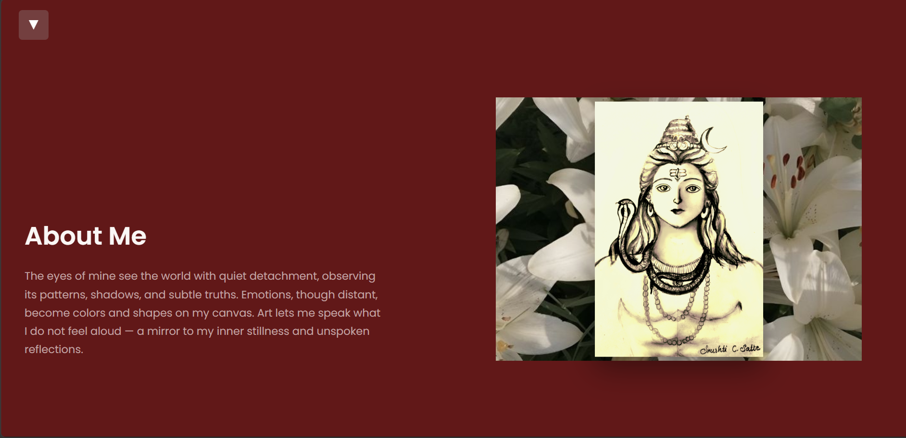

# 🎨 Viva La Vida - Artist Portfolio

A stunning, responsive artist portfolio website built with pure HTML, CSS, and JavaScript. Showcase your artworks, inspirations, skills, and connect with admirers through smooth animations and intuitive design.

## 🌐 Live Demo
Your portfolio is live here:  
**[https://vivalavidaportfolio.netlify.app/](https://vivalavidaportfolio.netlify.app/)**

  
*Note: Screenshot image will be added soon!*

## 📱 Responsive Preview
Works perfectly on desktop, tablet, and mobile devices.

## ✨ Features
- 🖼️ **Dynamic Art Gallery**: Explore artworks with lightbox and smooth transitions.
- 👩‍🎨 **About Me**: Personal story and journey.
- 💫 **Inspirations**: Curated collection of inspiring works.
- 🛠️ **Skills Showcase**: Highlight your artistic skills.
- 📱 **Fully Responsive**: Optimized for all screen sizes.
- ⚡ **Interactive Elements**: Hover effects, sliders, and animations powered by vanilla JS.
- 📩 **Contact Section**: Easy way to get in touch.

## 🛠️ Tech Stack

## 🚀 Quick Start (Local Development)
1. Clone or download this repository.
2. Open `index.html` in your web browser (e.g., Chrome, Firefox).
3. Enjoy the portfolio!

No build tools or servers required – it runs out-of-the-box.

## 📸 Screenshots
*Screenshots of key sections will be added here soon, including gallery, about, and mobile view.*

## 🤝 Contributing
Feel free to fork and submit pull requests for improvements!

---

⭐ Star this repo if you like it! Built with ❤️ for artists.

